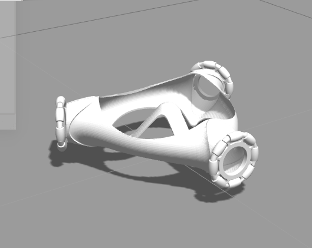
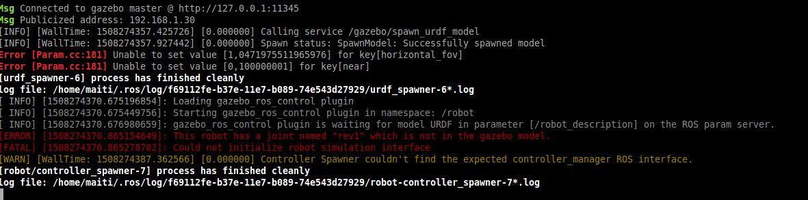
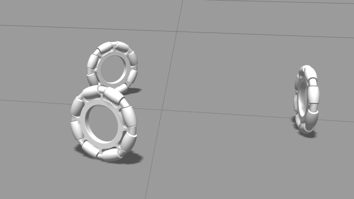
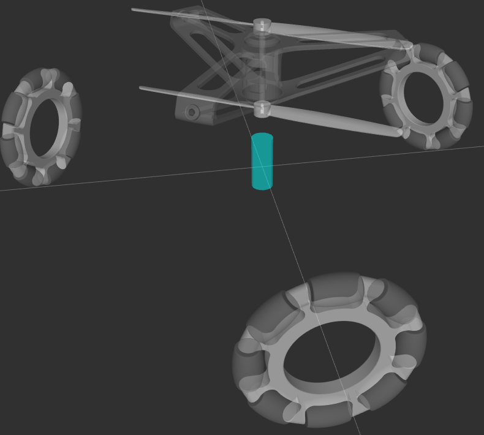
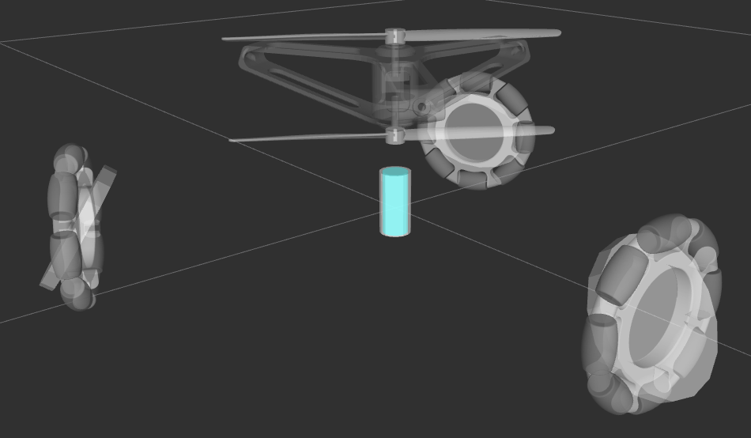
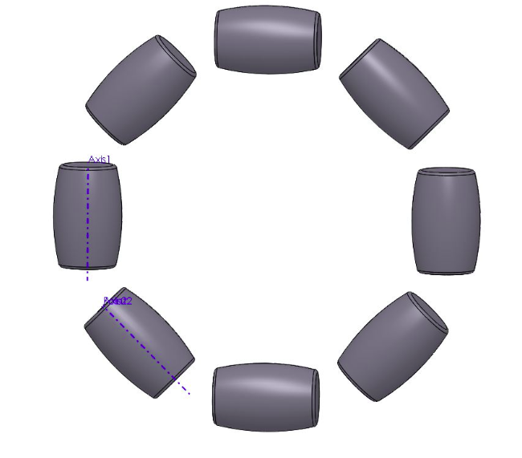
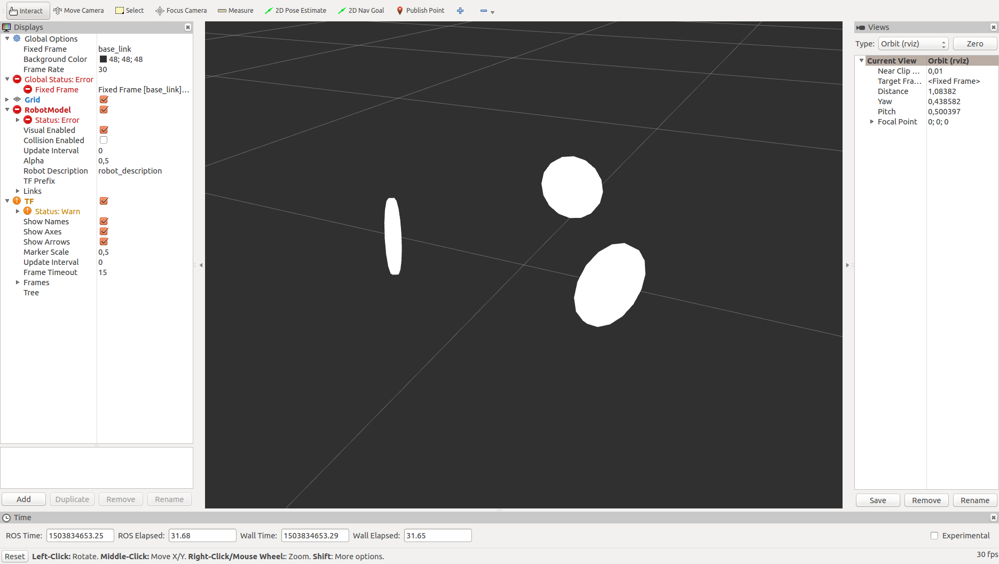

# robot

#17/10/17
roslaunch urdf_tutorials week_4.launch

Ja he colocat el main body dins de Gazebo
> 

Però em fa un error en la rev1, veure imatge.
> 

He fet algunes proves i no acaba d'anar, segueix amb l'error, un dels dubtes que tinc es amb el parent i child links, en la rev_1 el parent és la base i el child el fake link, linies 419 i 420.
EN canvi el rev_2" el parent és fake_link i el child és motor_frame, linies 456 i 457i això no m'acaba de lligar.
Segueixo treballant-t'hi al llarg de la setmana.

#30/09/17
roslaunch urdf_tutorials week_4.launch

> 

Ja està funcionant, he canviat els pesos, he revisat els moments d'inercia i al llançar-lo ja funciona. Però ara no arrenca el Rviz, i no puc ajustar la geometria de colisió

#22/09/17
roslaunch urdf_tutorials week_3.launch

> 

Ja tinc tot URDF construït, però com sempre surten coses, quan estic treballant amb els volums de colisió, veure els de les rodes, no hi ha manera de que quedin en posició, encara en queden per possar, per cert tb hi veuràs els moments inercia i els pesos.

> 

Si et va bé de fer-hi un cop d'ull aquesta setmana perfecte.

#03/09/17
roslaunch urdf_tutorials week_2.launch

He estat treballant amb URDF, i ja tinc tota la roda muntada, necessitaria tenir un parell de conceptes clars ja que dubto de dos coses. Com definir axis, i com definir el seu origen.
Quan els eixos son verticals les coordenades son més fàcils de definir, però com ho faig en el cas d'estar a 45º?
> 

Un cop tingui aixó solucionat. Com ho puc fer per replicar la roda que ja tinc feta? 
Adjunto imatge de l'estat de la roda.
> 

Per cert no se com fer-ho per treure aquest blanc nuclear i poder aplicar altres colors.

#26/08/17
roslaunch urdf_tutorials week_1.launch

Bon dia
ja tinc fet urf amb les tres rodes simples a 120º ente elles i amb les distàncies que toquen segons el model 3d.
Em fa un error en el base frame, quan indico un base frame em fa una cosa rara i es desalimien les rodes. veure imatges adjuntades.

> 

>  

